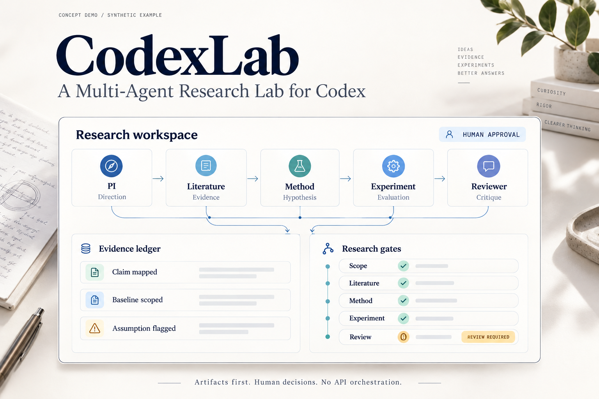

# CodexLab

**A Multi-Agent Research Lab for Codex.**

**Already using Codex? Build your research lab on its native subagents—without another LLM API key.**

Many API-driven multi-agent frameworks ask you to configure model API credentials, pay for separate API calls, and wire up an orchestration runtime. CodexLab uses the Codex environment you already sign in to. The framework needs no additional LLM API key or separate model API integration; native Codex subagents do the work.

Use your eligible existing Codex plan. Normal plan quotas still apply. Then organize the research into five roles: PI, Literature, Method, Experiment, and Reviewer.

[GitHub](https://github.com/ymping666/CodexLab) · [简体中文](README.zh-CN.md) · [Product brief](marketing/product-brief.md) · [Demo storyboard](marketing/demo-storyboard.md) · [Roadmap](ROADMAP.md)



*Alpha · Concept image with synthetic example data. An [actual local dashboard screenshot](assets/codexlab-dashboard-actual.jpg) is also available; it shows synthetic artifact status, not live agents.*

## Use the Codex runtime you already have

| Starting point | Many API-driven frameworks | CodexLab |
|---|---|---|
| Model access | Configure model API keys and providers | Use your signed-in Codex environment |
| Model-call billing | Separate model API usage | Your eligible existing Codex plan and its quotas |
| Agent execution | Integrate an SDK or orchestration runtime | Codex's native subagents |
| Research setup | Assemble roles and handoffs yourself | Generate a five-role lab and shared research artifacts |

The Python CLI creates files and checks artifacts. **Codex itself runs the agents.** CodexLab configures native research roles instead of implementing another LLM API scheduler. Experiment compute, datasets, and any external services you choose remain your own resources.

## Five roles, one accountable workflow

| Role | Responsibility | Expected handoff |
|---|---|---|
| **PI / Lab Lead** | Set direction, assign work, resolve disagreements, ask for human decisions | Research brief and synthesis |
| **Literature Scientist** | Verify sources, map prior art and collisions | Prior-art map and evidence ledger |
| **Method Scientist** | Turn a gap into a falsifiable method | Proposal and failure criteria |
| **Experiment Scientist** | Define baselines, implement experiments, record reproducible runs | Evaluation plan, commands and results |
| **Reviewer** | Challenge claims, confounds and missing comparisons | Critical review and revision requests |

The PI is the root Codex session; the other four roles are configured subagents. Five roles are a maximum working roster, not a requirement to launch every role simultaneously. Keep direction and final research decisions with the human researcher.

```text
Human researcher
       |
   PI / Lab Lead
       +--- Literature ---- verified sources
       +--- Method -------- falsifiable proposal
       +--- Experiment ---- reproducible evidence
       +--- Reviewer ------ objections and revisions
       |
   Shared artifacts + human decisions
```

## Start a lab

Requirements: Python 3.11 or later, a locally installed Codex CLI with native subagent support, and a usable Codex sign-in. Check your Codex version and plan against the current official documentation.

```bash
git clone https://github.com/ymping666/CodexLab.git
cd CodexLab

# Python 3.11+
python -m pip install -e .
python -m codexlab doctor

# Use a new, non-existing directory
python -m codexlab init ./my-lab --topic "Reliable evaluation of long-horizon AI agents"
python -m codexlab prompt ./my-lab

# Open the research workspace in Codex
cd my-lab
codex
```

Open the generated child workspace in Codex and review its `AGENTS.md` and `.codex` configuration. Complete Codex's native trust prompt for the configuration you have reviewed; project configuration can be ignored until that workspace is trusted. Paste the startup prompt printed by `prompt` into the Codex session. It asks the PI to inspect the workspace, delegate focused work using native subagents, and stop for the decisions specified in the workflow. Follow the installed Codex version's guidance if subagents require an explicit setting.

```bash
# From the repository, inspect artifacts and one stage's requirements
python -m codexlab status ./my-lab
python -m codexlab gate ./my-lab literature

# Explore a clearly labeled synthetic workspace
python -m codexlab demo ./demo-lab
python -m codexlab status ./demo-lab

# Open the real, read-only local dashboard
python -m codexlab serve ./demo-lab --port 8765
```

`init` and `demo` refuse to overwrite an existing target. `doctor` reports local prerequisites; it does not prove that a live session is authenticated or that every native agent has executed successfully. Commands also support the CLI help (`python -m codexlab --help`).

## Keep the research handoffs inspectable

| Stage | Evidence requested |
|---|---|
| Scope | Clear question, boundaries and success/failure criteria |
| Literature | Prior-art report and source-backed ledger |
| Method | Concrete proposal and falsifiable assumptions |
| Experiment | Baselines, protocol, results and recorded runs |
| Review | Critical report and unresolved objections |

Gates check required artifacts and their structure. Human researchers verify scientific claims and decide what the evidence supports. Synthetic demos cannot pass research gates.

An example **eight-week sprint target** is a prior-art map, a falsifiable proposal, a reproducible experiment package, and a draft grounded in the evidence collected. Scope and compute determine what is feasible. Publication or acceptance is never guaranteed.

## What's here today

- Dependency-free Python CLI for scaffolding, environment checks, status, startup prompts, synthetic demos, and structural gates.
- Local Codex project configuration and four specialized subagent instruction files, with the PI acting as the root session.
- Shared research artifacts and explicit review handoffs, designed for a researcher to inspect and revise.
- A read-only dashboard at `http://127.0.0.1:8765` for workspace status and structural gate results. This local dashboard differs from the promotional concept image.
- A launch concept image, demo storyboard, and bilingual project documentation.
- A portrait [launch poster](assets/codexlab-launch-poster.png) and three [Xiaohongshu copy variants](marketing/xiaohongshu.md).

This alpha delivers workspace setup, native-agent configuration, artifact checks, and a local dashboard. End-to-end scientific output and conference acceptance have not been validated. See the [roadmap](ROADMAP.md) and [development notes](DEVELOPMENT.md) for the next steps.

## Contribute

Start with one concrete bottleneck: citation verification, experiment reproducibility, reviewer feedback, or clearer handoffs. Include a small reproducible example and distinguish actual observations from synthetic fixtures. The code is licensed under [MIT](LICENSE).

## Codex references

Implementation targets Codex's native configuration surface. Review the official documentation for [subagents](https://learn.chatgpt.com/docs/agent-configuration/subagents), [authentication](https://learn.chatgpt.com/docs/auth), [non-interactive mode](https://learn.chatgpt.com/docs/non-interactive-mode), and the [configuration reference](https://learn.chatgpt.com/docs/config-file/config-reference). CodexLab is an independent project; it is not an official OpenAI product.
