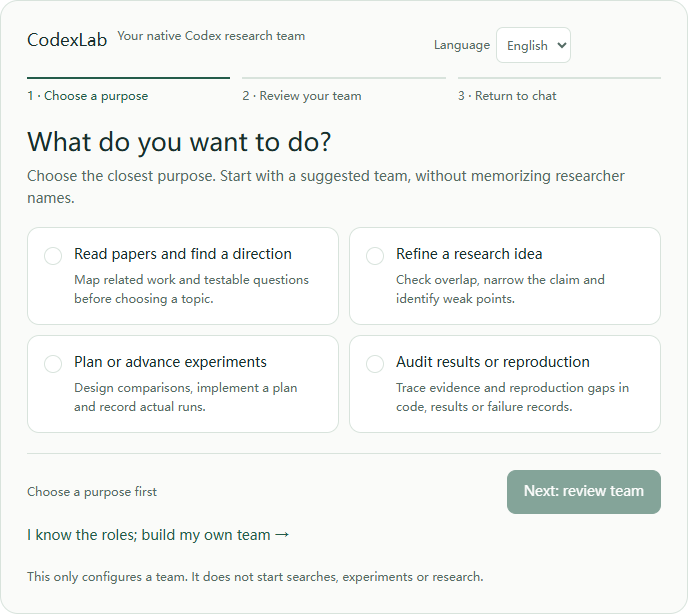

# CodexLab

**A Multi-Agent Research Lab for Codex.**

**已经有 Codex 套餐？安装一个 Skill，在当前项目直接搭科研 Lab，无需另配 LLM API Key。**

许多 API 驱动的多智能体框架，需要额外配置模型 API、承担独立调用费用，再接 SDK 和调度运行时。CodexLab 使用你已登录的 Codex 与原生子智能体：安装 Skill，输入 `$codexlab` 和研究方向，就在当前项目继续工作。

使用已有合适套餐，正常消耗 Codex 额度。默认流程不用下载 ZIP、切换工作区、安装 Python，也不用你输入终端命令。

[GitHub 仓库](https://github.com/ymping666/CodexLab) · [English](README.md) · [安装说明](START_HERE.md) · [Skill 指令](skills/codexlab/SKILL.md) · [路线图](ROADMAP.md)



*v0.2 Alpha · 上图为实际团队菜单截图。支持内嵌 HTML 的宿主可显示交互界面，其他客户端使用文字菜单。[材料仪表盘](assets/codexlab-dashboard-actual.jpg) 是另一项可选只读工具。*

## 先安装，再调用

在 Codex 聊天中，让官方 `skill-installer` 安装仓库里的独立 Skill：

```text
$skill-installer https://github.com/ymping666/CodexLab/tree/main/skills/codexlab
```

安装完成后，在**下一条消息**试着调用：

```text
$codexlab 帮我选择研究团队，展示引导菜单。
先只配置团队，不开始研究。
```

先选择用途，核对建议团队，按需逐位调整；在聊天确认后，再说明研究题目和任务范围。也可以直接给出研究任务，跳过团队配置。如果客户端尚未识别 Skill，刷新 Skill 列表，或按客户端提示重新加载/重启后重试。[官方安装器](https://github.com/openai/skills/tree/main/skills/.system/skill-installer) 支持 GitHub 仓库路径；是否已安装，以你自己的 Codex 返回结果为准。

科研材料保存在：

```text
当前项目/
└── codexlab-runs/
    └── <topic-slug>/
```

当前调用会话担任 PI，按需要使用四个专门 worker 角色。默认 Skill 流程直接在当前项目运行，无需另开 Lab 工作区。

## 先选用途，再配团队

新手入口提供四个具体用途：**读论文找方向、打磨研究想法、设计推进实验、检查结果或复现**。菜单默认英文，可通过顶部 **Language / 语言** 切换为中文；用途、职责、风格、组合、状态提示和配置指令一起切换，保留已选团队与当前步骤。选择后查看一个小团队，职责、名字和调整按钮逐行对应；全部风格和五套完整组合按需展开。

| 职责 | 三种工作风格 |
|---|---|
| PI / 当前会话 | Aster 综合统筹 / Orion 探索驱动 / Quinn 决策收敛 |
| 文献科学家 | Atlas 系统综述 / Scout 前沿雷达 / Flint 反证检索 |
| 方法科学家 | Nova 机制驱动 / Theo 理论约束 / Mira 极简实证 |
| 实验科学家 | Forge 工程复现 / Vector 统计稳健 / Pulse 小步验证 |
| 独立审查员 | Sage 综合审查 / Rook 对抗挑错 / Trace 复现审计 |

这是五类职责下的十五种**任务指令风格**，不是同时运行十五个智能体，也不代表不同模型。保留 PI，暂不需要的其他职责可以关闭。组合是可调整的起点，尚未证明哪套效果最好。

流程是 **选择用途 → 核对团队 → 交回聊天**。支持聊天桥接时，确认按钮请求发送完整配置；其他情况下复制或手动选中指令，再自行粘贴发送。点击菜单、复制指令都不等于确认团队或开始研究。内嵌菜单不需要浏览器服务或 Python。详见 [团队、组合与使用示例](docs/teams.md)。

```text
$codexlab 让 Orion、Atlas 和 Theo 分析我提供的研究问题。
只做分析，不初始化材料，也不运行实验。
```

## PI 带队，四个原生 worker 按职责工作

| 角色 | 负责什么 | 交付什么 |
|---|---|---|
| **PI / Lab Lead** | 确定方向、分配任务、整合争议 | 研究简报与综合结论 |
| **Literature Scientist** | 查证来源、梳理已有工作、排查创新碰撞 | 文献地图与证据账本 |
| **Method Scientist** | 将研究空白变成可证伪方法 | 方法方案与失败判据 |
| **Experiment Scientist** | 设计 baseline、记录可复现实验 | 实验协议、命令与结果 |
| **Reviewer** | 挑战主张、混杂因素与缺失对照 | 审查报告与修改意见 |

Skill 包含**指令、角色任务约定和材料模板**。PI 将相应角色职责写入交给原生 worker 的任务。安装 Skill **不会自动注册四个自定义 TOML `agent_types`**，也不会自动改写当前项目配置。

实际原生执行依赖你的 Codex 客户端是否暴露 spawn/委派工具。运行记录要区分真实子线程与根会话自己完成的工作。没有这些工具时，使用明确标记的**串行回退**，这不属于原生并行执行。研究方向与最终判断由人负责。

## 用你已经拥有的 Codex

| 起点 | 许多 API 驱动框架 | CodexLab Skill |
|---|---|---|
| 模型访问 | 配置模型 API Key 与供应商 | 使用已登录的 Codex |
| 模型调用计费 | 单独计算模型 API 调用费用 | 消耗已有合适套餐的 Codex 额度 |
| 智能体执行 | 接入 SDK 或搭建调度运行时 | 可用时使用 Codex 原生 worker |
| 科研准备 | 自己组织角色和交接 | 安装 Skill，在当前项目调用 |

无需额外模型 API Key，不代表无限免费运行。实际使用受套餐资格与额度约束；实验计算、数据和自行接入的外部服务仍使用你自己的资源。

## 科研交接，有材料可查

每次研究收集问题范围、已有工作、方法方案、实验计划与记录，以及 Reviewer 反馈。可以打开文件检查：哪些主张有来源，哪些实验真的运行过，还有哪些反对意见没有解决。

当前 Alpha 提供科研工作流与材料工具，完整科研研究尚未完成端到端验证。详见 [验证与限制](docs/validation.md)。

## 可选 CLI 与项目配置

进阶用户仍可通过 CLI 创建一个**独立、按项目 TOML 配置角色的 Lab**。这条路径需要 Python 3.11+，并需要单独打开和信任生成的项目；默认 Skill 入口不依赖它。

```bash
git clone https://github.com/ymping666/CodexLab.git
cd CodexLab
python -m pip install -e .
python -m codexlab doctor

# 进阶项目配置方式：目标目录必须不存在
python -m codexlab init ./my-lab --topic "长程 AI 智能体的可靠评测"
python -m codexlab prompt ./my-lab
python -m codexlab status ./my-lab
python -m codexlab gate ./my-lab literature

# 可选合成示例和只读材料仪表盘
python -m codexlab demo ./demo-lab
python -m codexlab serve ./demo-lab --port 8765
```

进阶路径中，审阅并信任独立的 `my-lab` 项目，再在新聊天读取 `research/kickoff.md` 开始。可选的 `status`、`gate`、`serve` 也支持 Skill 生成的运行目录；`prompt` 则用于带 kickoff 文件的项目配置路径。结构检查不证明科学主张或实际智能体执行。合成 Demo 无法通过科研 gate。

`http://127.0.0.1:8765` 仪表盘**只读，不执行智能体**。独立本地控制 UI 属于未来方向。完整可选命令见 `python -m codexlab --help`。

## Alpha 交付

- 可在当前项目使用的独立 [CodexLab Skill](skills/codexlab/SKILL.md)。
- PI 指令、四个原生 worker 角色任务约定和科研材料模板。
- 明确的证据交接；缺少原生 spawn 工具时标记串行回退。
- 可选项目配置式 CLI、合成 Demo、结构检查和只读本地仪表盘。

详见 [验证与限制](docs/validation.md)、[贡献指南](CONTRIBUTING.md) 和 [路线图](ROADMAP.md)。欢迎贡献引用查证、实验复现、审查反馈和角色交接方面的改进。代码采用 [MIT 协议](LICENSE)。

CodexLab 是独立项目，不是 OpenAI 官方产品。相关官方说明：[Skill 安装器](https://github.com/openai/skills/tree/main/skills/.system/skill-installer)、[子智能体](https://learn.chatgpt.com/docs/agent-configuration/subagents) 与 [认证](https://learn.chatgpt.com/docs/auth)。
