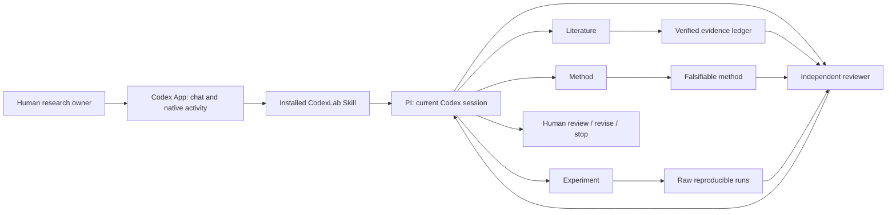

# How CodexLab works

Many API-driven multi-agent frameworks require model credentials, separate inference billing, and an external orchestration runtime. CodexLab takes the native Codex route: researchers use their existing eligible Codex sign-in and native subagents, with no separate model API key on that path. Model usage remains subject to the user's Codex account and limits.

CodexLab is distributed primarily as a self-contained Codex Skill. Install `skills/codexlab` through `$skill-installer`, then invoke `$codexlab` in an existing research project. The current conversation is PI; Codex supplies execution, delegation, approvals and native activity. Researchers do not need to download the source checkout, switch projects, install Python or type terminal commands for this path.

The installed folder contains `SKILL.md`, UI metadata, team/protocol references, nine artifact templates and an optional standalone initializer. A new run normally writes to `codexlab-runs/<topic-slug>/` in the active project. Resume reads existing evidence and decisions without reinitializing. Bounded analysis and initialization-only requests do not automatically begin a full research run. See [the Skill entry guide](../START_HERE.md).

Four specialist responsibilities are delivered in native agent task instructions, with an absolute artifact root and exclusive write paths. They are not newly registered custom `agent_type` names. Installing the Skill does not copy TOML agents, alter project/global configuration, or require another session to load a generated project. Concurrency and permissions inherit from the active session; a serial fallback must be labeled when native delegation is unavailable.

The optional Python CLI checks Skill-generated artifacts through their compatible manifest and provides a read-only dashboard. Its standalone initialization mode also retains the earlier project-scoped TOML roles and kickoff prompt; that advanced mode requires opening/trusting the generated project. `prompt` applies to those standalone projects, not Skill runs. The dashboard cannot start agents or display live native session events. Without the CLI, PI records manual material assessments without claiming an automated gate passed.

The lab contains five roles: a PI in the primary Codex session and four specialists. The PI assigns bounded work and integrates evidence. Literature checks primary sources and collisions; method proposes a falsifiable approach; experiment implements and preserves raw runs; reviewer independently audits the original artifacts. Model and reasoning choices inherit from the active session. Role count is a design constraint, not an obligation to run all specialists simultaneously.

## Stage contracts

| Stage | Owner | Required artifacts | Scientific decision |
| --- | --- | --- | --- |
| Scope | PI | `research/brief.md` | Is the question measurable with available resources? |
| Literature | Literature | `literature/prior-art.md`, `evidence/ledger.jsonl` | Is the distinction plausible given the closest verified work? |
| Method | Method | `method/proposal.md` | Is the mechanism implementable and falsifiable? |
| Experiment | Experiment | `experiments/plan.md`, `experiments/results.md`, `experiments/runs.jsonl` | Do actual measurements support the bounded claim? |
| Review | Reviewer | `review/report.md` | Are evidence, baselines, protocol, and interpretation defensible? |

When installed, the optional validator detects incomplete templates, malformed records, and missing artifacts. It checks individual stages; the PI enforces dependency order and records stage decisions. It cannot determine whether an algorithm is sound, a paper is understood correctly, or a result generalizes. A structural pass remains subject to PI judgment and independent review. A successful experiment can produce a negative or null effect; a crashed process provides a failure log, not a fabricated successful metric.

## A dedicated local interface, later

A separate CodexLab interface could connect a local backend to the official [Codex App Server](https://learn.chatgpt.com/docs/app-server) for conversations, approvals, and streamed events. That would be additional development. The shipped Skill operates inside Codex's existing interface; the read-only dashboard is not an App Server controller.

## Evidence ownership and handoffs

Each specialist receives an input snapshot, output paths, exclusive write ownership, limits, and completion checks. Independent reads can run in parallel. Shared ledger writes are serialized. Review reads the original sources, code, and raw runs; it does not silently repair the evidence it evaluates. Every handoff carries file paths, evidence/run identifiers, observed facts, interpretations, uncertainty, and blockers.

`research/decisions.md` preserves scope changes, frozen protocols, deviations, and stage decisions. Paper text never becomes the only record of an experiment. Raw evidence includes actual commands, random seeds, code/data identity, environment, missing/failed runs, and outputs. Bounded searches preserve query/date limitations rather than assert proven novelty.

Stop at budget exhaustion, unavailable resources, invalidating leakage, unverified essential evidence, or a prior-art collision that defeats the claim. Keep the blocker and recovery action visible. Null results and baseline wins belong in the deliverable. Human researchers remain accountable for scientific claims and publishing decisions.
